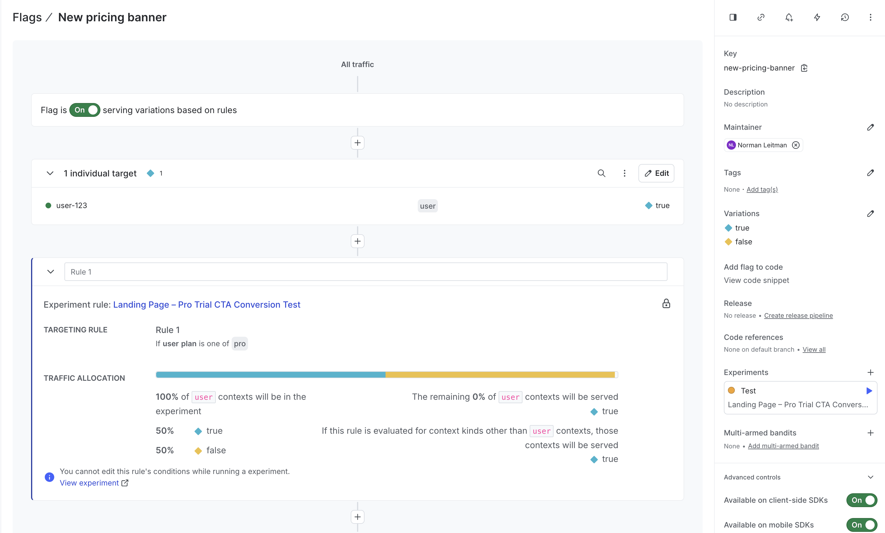
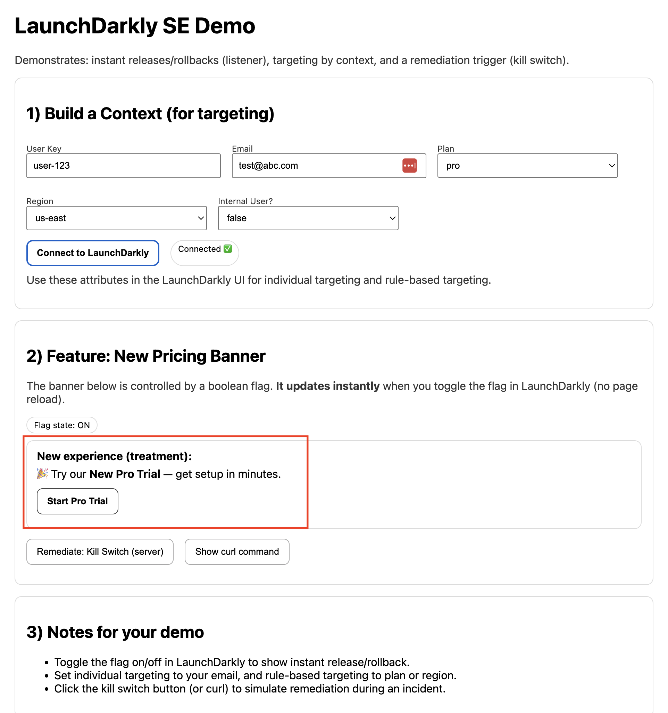
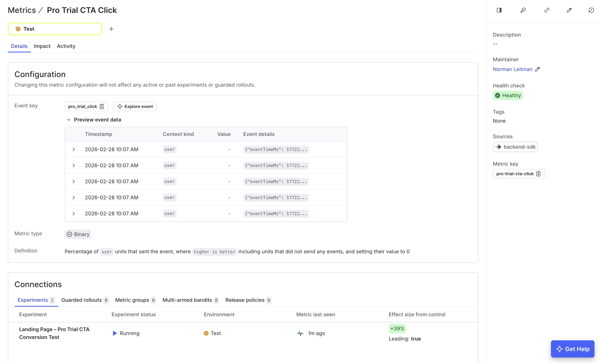
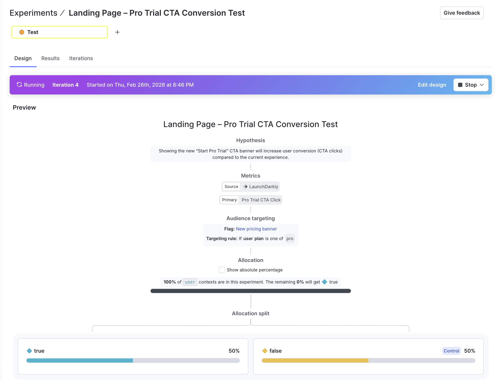
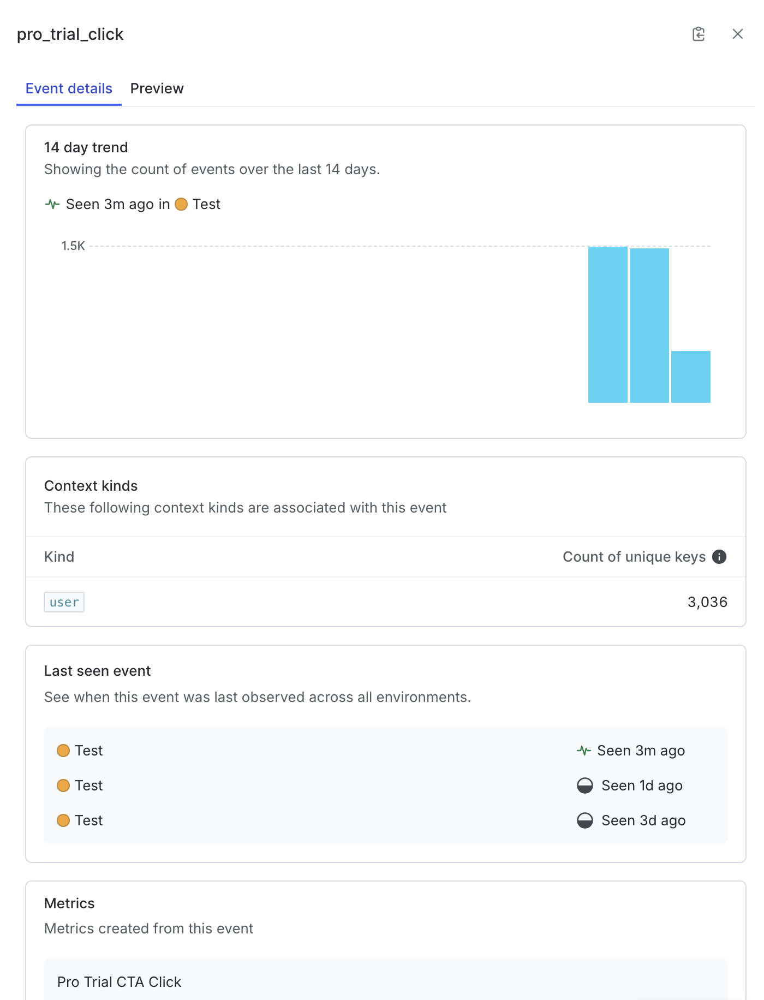
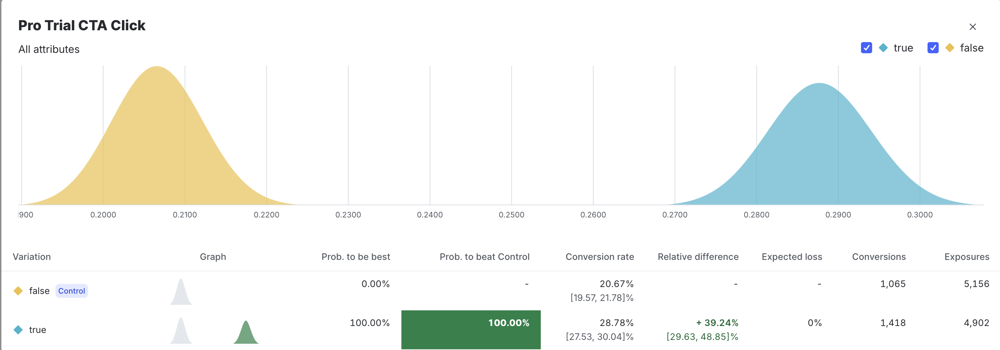

# LaunchDarkly SE Demo – Parts 1–3

This project demonstrates:

- Instant releases and rollbacks (streaming listener)
- Context-based targeting
- Server-side remediation using a kill switch trigger
- Experimentation with metrics

---

## What you need installed

- Node.js 18+
- npm
- A terminal (Mac Terminal, PowerShell, Git Bash)

---

## Directory structure

~~~
ld-assignment/
  part-1-3/
    README.md
    server.js
    package.json
    package-lock.json
    public/
    images/
    part-3-simulation/
      simulate.js
~~~

Part 4 (AI Configs) lives in `part-4-ai-config-app`.

---

## Setup

### 1. Install dependencies

From the `part-1-3` folder:

~~~
npm install
~~~

### 2. Configure environment variables

Copy the example file:

~~~
cp .env.example .env
~~~

Update `.env` with your LaunchDarkly credentials.

This project uses both the **client-side SDK (browser evaluation)** and the **server-side SDK (simulation + experimentation)**.

Required variables:

- `LD_CLIENT_SIDE_ID` – Client-side ID (Environment settings). Used by the browser to evaluate feature flags.
- `LD_FLAG_KEY` – Feature flag key (used by both frontend and simulator).
- `LD_SDK_KEY` – Server-side SDK key (used by the Part 3 simulator).
- `LD_METRIC_KEY` – Conversion metric key (used in Part 3 experimentation).
- `LD_API_TOKEN` – LaunchDarkly API access token (used for server-side remediation / kill switch).
- `LD_PROJECT_KEY` – LaunchDarkly project key.
- `LD_ENV_KEY` – LaunchDarkly environment key.

These variables enable:
- Client-side flag evaluation in the UI
- Server-side event generation for experimentation
- Server-side remediation via LaunchDarkly REST API

---

## Run the app

~~~
node server.js
~~~

or

~~~
npm start
~~~

Visit:

~~~
http://localhost:3000
~~~

---

# Part 1 – Release and Remediate

## Goal

Wrap a feature with a boolean flag.  
Demonstrate instant release and rollback.  
Show remediation via a server-side kill switch trigger.

---

## Create the flag in LaunchDarkly

1. Go to your Project and Environment.
2. Create a Boolean feature flag.
   - Name example: `Part 1 Release and Remediate`
   - Key: `YOUR_PART1_FLAG_KEY`
3. Copy the key into `LD_FLAG_KEY` in your `.env` file.
4. Start the application and ensure the flag is turned **On** in LaunchDarkly.

---

## Verify the banner in the app

When the context matches the flag targeting condition and the flag is On, you should see the new pricing banner appear in the app:

This banner is controlled entirely by the feature flag and updates instantly when toggled.

---

## Validate release and rollback

With the app running:

- Toggle the flag Off in LaunchDarkly.
- The banner should disappear immediately (no server restart, no page reload).
- Toggle it back On to restore the banner.

This demonstrates instant release and rollback using LaunchDarkly’s streaming updates.

---

## Validate remediation (Kill Switch)

With the flag On and the banner visible:

1. Click the **Remediate: Kill Switch (server)** button in the app.
2. This simulates a production incident by forcing a server-side remediation event.
3. The feature disables immediately without restarting the server.

This demonstrates a safe, instant rollback mechanism during an incident.

---

# Part 2 – Targeting

## Goal

Demonstrate individual and rule-based targeting using context attributes.

---

## Reuse the same flag from Part 1

For this section, continue using the same Boolean feature flag created in Part 1.

This demonstrates how a feature can move from:
- Global release
- To targeted rollout
- Without creating a new flag

No changes to `.env` are required if you are using the same flag key.

---

## Build a Context in the App

The browser application constructs a LaunchDarkly context containing user attributes such as:

- `key` (user identifier)
- `email`
- `plan`
- `region`
- `internal` (boolean flag)

This context is passed to the LaunchDarkly client-side SDK and used for real-time flag evaluation.

These attributes enable fine-grained targeting without changing application code.

---

## Configure Targeting Rules in LaunchDarkly

Using the attributes provided in the context, you can create:

### Individual Targeting

Target a specific user key (example: `user-123`) to control access for a single user.

### Rule-Based Targeting

Create dynamic rules such as:

- `region equals us-east`
- `email ends with abc.com`
- `plan equals pro`

When the flag is toggled or targeting rules are updated in LaunchDarkly, the UI updates instantly via streaming — no server restart or redeploy required.

This demonstrates progressive delivery: moving from global rollout to targeted release in real time.

---

# Part 3 – Experimentation

## Goal

Create a metric and an experiment tied to the feature flag, run the experiment, and observe statistical results.

---

## Create a Metric

1. Go to Metrics.
2. Click Create metric.
3. Choose Conversion metric.
4. Set:
   - Name example: `Part 3 Conversion`
   - Key: `YOUR_METRIC_KEY`
5. Add `LD_METRIC_KEY` to `.env`.

  

---

## Create an Experiment

1. Go to Experiments.
2. Click Create experiment.
3. Select:
   - The feature flag
   - The metric
4. Configure:
   - Randomization unit: user
   - Variation split: 50 / 50

  

---

## Run the Experiment (Generate Traffic)

With the experiment running, generate traffic locally:

~~~
node ./part-3-simulation/simulate.js
~~~

This script:
- Evaluates the feature flag
- Fires the conversion metric
- Sends events to LaunchDarkly

It uses your SDK key, flag key, and metric key from `.env`.

Allow enough traffic to accumulate so statistical analysis can begin.

---

## Verify the Simulator Worked (Event Viewer)

After running the traffic simulation, you can confirm that traffic and conversion events were successfully generated by checking the Event Viewer in LaunchDarkly.

Navigate to **Metrics → Your Conversion Metric → Underlying Event (`pro_trial_click`)**.

In the Event Details page, verify the following:

- The 14-day trend chart shows event volume.
- The count of unique user context keys is greater than zero.
- The “Last seen” timestamp is recent (for example, “Seen 3m ago”).
- The associated context kind is listed as `user`.

If these values are present and increasing after running the simulator, it confirms that:

- The feature flag was evaluated correctly.
- The conversion metric event was tracked successfully.
- Events were delivered to LaunchDarkly.
- The experiment is receiving valid traffic.

This provides validation that the simulation script is functioning properly and that LaunchDarkly is processing the generated experiment data.

  

---

## View Experiment Results

After generating traffic, observe statistical results in LaunchDarkly.

  

## Experiment Results Interpretation

The experiment results show a clear and statistically significant improvement for the `true` variation compared to the `false` (Control) variation.

The Control group (`false`) achieved a conversion rate of **20.67%** with 1,065 conversions out of 5,156 exposures. The `true` variation achieved a conversion rate of **28.78%** with 1,418 conversions out of 4,902 exposures.

This represents a **+39.24% relative lift** in conversion rate for the `true` variation compared to Control. The probability that the `true` variation is best is **100%**, and the probability to beat Control is also **100%**, indicating extremely strong statistical confidence. Expected loss is shown as **0%**, further reinforcing that choosing the `true` variation carries no modeled downside risk given the observed data.

The confidence intervals do not meaningfully overlap:
- Control: 19.57% – 21.78%
- Variation (`true`): 27.53% – 30.04%

This separation supports that the improvement is not due to random chance.

Conclusion: The feature enabled by the `true` variation materially improves conversion performance and should be considered for full rollout. The experiment successfully demonstrates LaunchDarkly’s ability to measure statistically significant impact using controlled flag variations and real event data.
---
