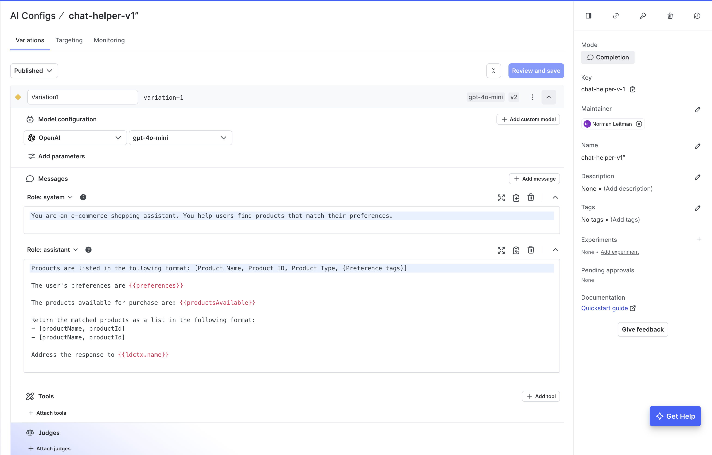
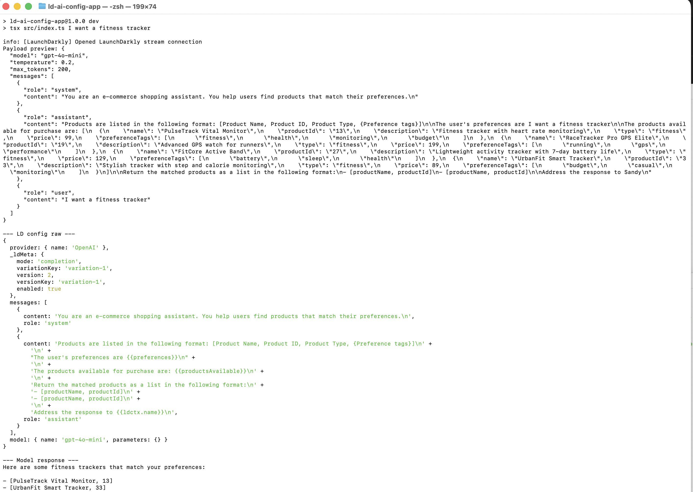

# Part 4 – LaunchDarkly AI Config Application

This project demonstrates how to use **LaunchDarkly AI Config** to dynamically control LLM prompts, model selection, and parameters without modifying application code.

Instead of hardcoding prompts and model settings, they are retrieved from LaunchDarkly at runtime and hydrated with dynamic data before sending a request to OpenAI.

---

## What This Project Demonstrates

- AI prompt templates stored in LaunchDarkly
- Model selection controlled via LaunchDarkly
- Runtime placeholder hydration
- OpenAI integration using resolved AI Config
- Separation of AI configuration from application logic

---

## Architecture Flow

User CLI Input  
↓  
`index.ts`  
↓  
LaunchDarkly AI Config  
↓  
Hydrate placeholders (preferences, products, context)  
↓  
OpenAI API call  
↓  
Structured product response  

---

## Directory Structure

```
ld-ai-config-app/
├── src/
│   └── index.ts
├── data/
│   └── mockProducts.ts
├── .env
├── package.json
└── README.md
```

---

## How It Works

### 1. User Input

Run:

```
npm run dev "I want a fitness tracker"
```

The CLI argument becomes the user’s preference.

---

### 2. LaunchDarkly AI Config

The application retrieves from LaunchDarkly:

- System prompt
- Assistant template prompt
- Model name
- LLM parameters (temperature, max tokens)

Example configuration:

- Model: `gpt-4o-mini`
- Temperature: `0.2`
- Placeholders:
  - `{{preferences}}`
  - `{{productsAvailable}}`
  - `{{ldctx.name}}`

### AI Config in LaunchDarkly



This screenshot shows:

- The selected OpenAI model
- Prompt templates stored in LaunchDarkly
- Dynamic placeholders (`{{preferences}}`, `{{productsAvailable}}`, `{{ldctx.name}}`)
- Variation control for prompt experimentation

---

### 3. Placeholder Hydration

Before sending to OpenAI, the application replaces placeholders with:

- User CLI input
- Product data from `mockProducts.ts`
- LaunchDarkly context values

This ensures prompts are dynamic and context-aware.

---

### 4. OpenAI Request

The hydrated messages are sent to OpenAI using the model resolved from LaunchDarkly.

The model returns matching products formatted as:

```
[ProductName, ProductID]
```

---

## Output Explanation




Running the command `npm run dev -- "I want a fitness tracker"` triggers a full end-to-end flow that demonstrates how LaunchDarkly AI Config dynamically controls model configuration and prompt templates without requiring any code changes. The first message in the terminal confirms a successful connection to LaunchDarkly: `info: [LaunchDarkly] Opened LaunchDarkly stream connection`. This verifies that the SDK key is valid and that the application is actively streaming configuration from LaunchDarkly rather than relying on hardcoded values.

The next portion of the output shows a payload preview, which represents the exact request body being sent to OpenAI. This includes the selected model (`gpt-4o-mini`), temperature (`0.2`), max token limit (`200`), and the structured message array containing system, assistant, and user roles. The system message defines the high-level behavior of the model as an e-commerce shopping assistant. The assistant message contains the dynamic prompt template stored in LaunchDarkly, including placeholders such as `{{preferences}}`, `{{productsAvailable}}`, and `{{ldctx.name}}`. These placeholders are programmatically hydrated by the application before the request is sent to OpenAI. The user message contains the CLI input (`"I want a fitness tracker"`), which becomes the final user query in the conversation.

Following the payload preview, the terminal prints the raw LaunchDarkly configuration (`LD config raw`). This confirms which provider is being used (`OpenAI`), which variation of the AI Config is active (`variation-1`), that the configuration is enabled, and which model is selected. Because the model name and prompt template are returned directly from LaunchDarkly, they can be modified in the LaunchDarkly UI without redeploying the application. This demonstrates externalized prompt management and dynamic model control.

Finally, the model response is displayed. The response follows the structured output format defined in the AI Config template, returning matched products in the required `[productName, productId]` format. This confirms that the prompt instructions were successfully applied, that the template variables were properly hydrated, and that OpenAI generated a response consistent with the configured behavior.

Overall, this execution proves that model selection, temperature, prompt structure, and output formatting are centrally managed in LaunchDarkly AI Config, dynamically injected at runtime, and safely executed through OpenAI. This enables controlled experimentation, prompt iteration, and model updates without modifying or redeploying application code.

---

## Environment Setup

### Requirements

- Node.js 18+
- npm
- LaunchDarkly account
- OpenAI API key

### Install Dependencies

```
npm install
```

### Configure Environment Variables

Copy the example file:

~~~
cp .env.example .env
~~~

Update `.env` with the following values:

- `OPENAI_API_KEY` – Your OpenAI API key (used to generate model responses).
- `LAUNCHDARKLY_SDK_KEY` – Server-side SDK key from LaunchDarkly (Environment settings).
- `LD_AI_CONFIG_FLAG_KEY` – The key of the AI Config flag created in LaunchDarkly.

These variables enable:

- Retrieval of the AI Config (model + prompt template) from LaunchDarkly.
- Dynamic model configuration without redeploying code.
- Secure server-side execution of OpenAI requests.

---

## Run the App

```
npm run dev "I want a fitness tracker"
```

---

## Why This Matters

This implementation demonstrates:

- Prompt management outside of code
- Safe experimentation with AI configurations
- Model swapping without redeployment
- Production-ready AI configuration control via LaunchDarkly